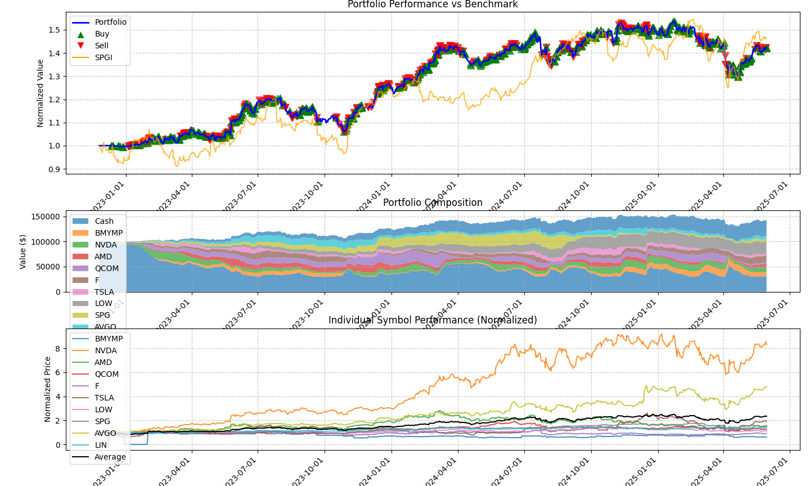

# EasyA-Consensus-Hackathon---Toronto

## Educational Disclaimer

This repository contains code developed for the EasyA Consensus Hackathon in **Toronto, Canada**. This project is:
- **PURELY EDUCATIONAL** and created for learning blockchain development concepts
- **NOT ASSOCIATED** with any real cryptocurrency trading or financial activities
- **NO REAL FUNDS** were used or are intended to be used with this codebase
- **DEVELOPED SOLELY** for demonstration of technical concepts in a hackathon environment

This project is **NOT** intended for production use or financial applications in the current stage.

## Project Description
This project builts based on [the repo from aptos-agent from aptos-labs](https://github.com/aptos-labs/aptos-agent). Thanks to the Aptos for the support during the hackathon.

Aptos Agent Backtester: AI/ML-Powered Blockchain Trading Aptos Agent combines machine learning prediction with Aptos blockchain execution for automated trading. Features include **technical analysis signals**, on-chain transaction execution, **wallet management**, comprehensive **backtesting**, real-time **portfolio tracking**, and risk management parameters for DeFi traders.


Here is the snapshot of the project. 

\

### Figure 2: Single Stock Portfolio Analysis Dashboard

Figure 2 shows performance for a single asset (QBTS).
\
\
\

### Figure 3: Multi-Stock Portfolio Analysis Dashboard
Backtest Report: Total Return: 42.11%, Sharpe: 1.11, Max Drawdown: -15.51%, Win Rate: 59.80%, Number of Trades: 1694, CAGR: 15.02%, Sortino: 1.88

Figure 3 represents the multi-stock portfolio backtesting visualization with three comprehensive panels:

1. **Portfolio Performance Panel (Top)**
- Blue line tracks the portfolio's normalized value
- **Green** triangles mark **buy** signals and **red** triangles indicate **sell** signals
- Orange **SPGI** benchmark line demonstrates our strategy's outperformance, especially during market corrections
- Portfolio maintains consistent growth trajectory with strategic entry/exit points

2. **Portfolio Composition Panel (Middle)**
* Stacked area chart visualizing asset allocation across multiple stocks and cash positions
* Dynamic allocation shows how the system actively rebalances based on market conditions
   

3. **Individual Symbol Performance Panel (Bottom)**
* Line chart comparing normalized performance of each stock in the portfolio
* Black line represents the average performance across all securities


[Here is the link of the presentation](https://www.canva.com/design/DAGnnzZRxhU/VGBKUeKuUp-0kf3HJntAHg/edit?utm_content=DAGnnzZRxhU&utm_campaign=designshare&utm_medium=link2&utm_source=sharebutton)


## Technical Explanation

Our Aptos Agent project leverages several key technologies:

### Core Technologies
- **Python** for backend development and ML model & Strategy implementation
- **Scikit-Learn/TensorFlow/PyTorch** for training prediction models
- **Aptos Move** for smart contract development
- **React** for frontend dashboard interface

### Aptos Blockchain Technologies
We specifically leveraged Aptos's unique features:

1. **Move VM (potential)** - Used for secure, deterministic smart contract execution that enables our automated trading strategies with reliable transaction outcomes

2. **Parallel Execution Engine** - Aptos's BlockSTM allows high throughput transactions, critical for real-time trading decisions during market fluctuations

3. **Aptos SDK** - Integrated their Python SDK for seamless blockchain interaction from our prediction models

4. **Aptos Tokenization Framework** - For portfolio management and tracking digital assets

5. **Fast Finality** - Aptos's sub-second finality ensures our trading signals are executed promptly, reducing slippage in volatile markets

<!-- What makes our project uniquely possible on Aptos is the combination of their high-performance blockchain (over 160,000 TPS) with sub-second finality, which is essential for algorithmic trading where execution speed matters. The Move language's resource-oriented programming also provides better security guarantees for managing user funds in a DeFi context compared to other blockchain environments. -->


### Trading Strategy Overview (Not included in the repo)

The multi-stock portfolio backtest implementation employs a sophisticated adaptive trading strategy with several key components:

#### Strategy Components

1. **Intelligent Stock Selection**
   * Uses fundamental and technical filters to identify promising candidates from major indices
   * Employs momentum, value, and quality factors to rank stocks based on the selected strategy 
   * Automatically adapts selection criteria based on broader market conditions

2. **Adaptive Position Sizing**
   * Dynamically adjusts position sizes based on volatility, trend strength, and technical indicators
   * Implements volatility-scaled position sizing (larger positions in lower volatility assets)
   * Increases exposure during identified bottoming patterns with volume confirmation
   * Reduces position sizes during high market uncertainty periods

3. **Multi-factor Entry Signals**
   * Combines technical indicators (RSI, Moving Average crossovers) with trend analysis
   * Identifies potential buy opportunities during oversold conditions (RSI < 30)
   * Incorporates rate-of-change and momentum factors for entry timing
   * Signal reversal capability that can switch between long and short bias based on market regime

4. **Risk Management Rules**
   * Implements dynamic trailing stops based on profit levels (tighter stops at higher profits)
   * Uses multi-tier take-profit levels (scaling out at 25%, 40% profit targets)
   * Hard stop-losses at predetermined maximum loss thresholds
   * Portfolio-level diversification rules to limit exposure to similar assets

## Setup Instructions

### Prerequisites
- Python 3.9+
- Aptos SDK
- Required Python libraries: pandas, numpy, matplotlib, scikit-learn, yfinance

### Installation
```bash
# Clone the repository
git clone https://github.com/Jamie1377/EasyA-Consensus-Hackathon---Toronto.git
cd aptos-agent-hackathon

# Install dependencies
pip install -r requirements.txt

# Configure environment
cp .env.example .env
# Edit .env with your configuration