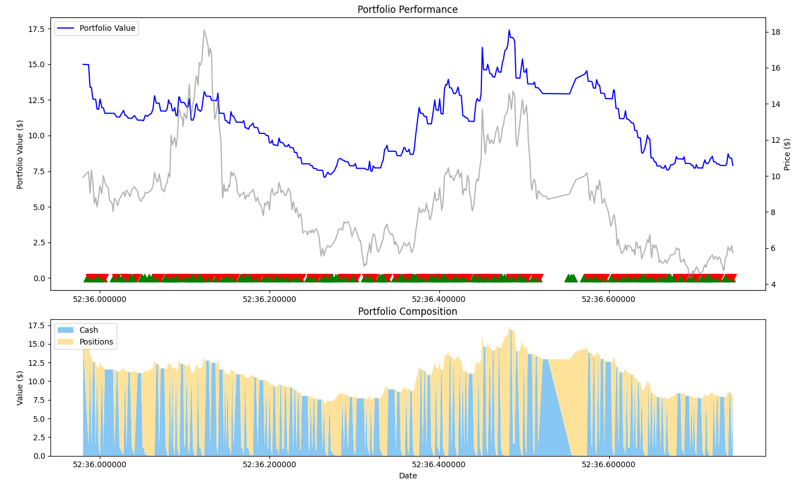

# EasyA-Consensus-Hackathon---Toronto
Aptos Agent: AI-Powered Blockchain Trading  Aptos Agent combines machine learning prediction with Aptos blockchain execution for automated trading. Features include technical analysis signals, on-chain transaction execution, wallet management, comprehensive backtesting, real-time portfolio tracking, and risk management parameters for DeFi traders.

\
Here is the snapshot of the project. (Not that good)
\

The link of the presentation:

https://www.canva.com/design/DAGnnzZRxhU/VGBKUeKuUp-0kf3HJntAHg/edit?utm_content=DAGnnzZRxhU&utm_campaign=designshare&utm_medium=link2&utm_source=sharebutton
