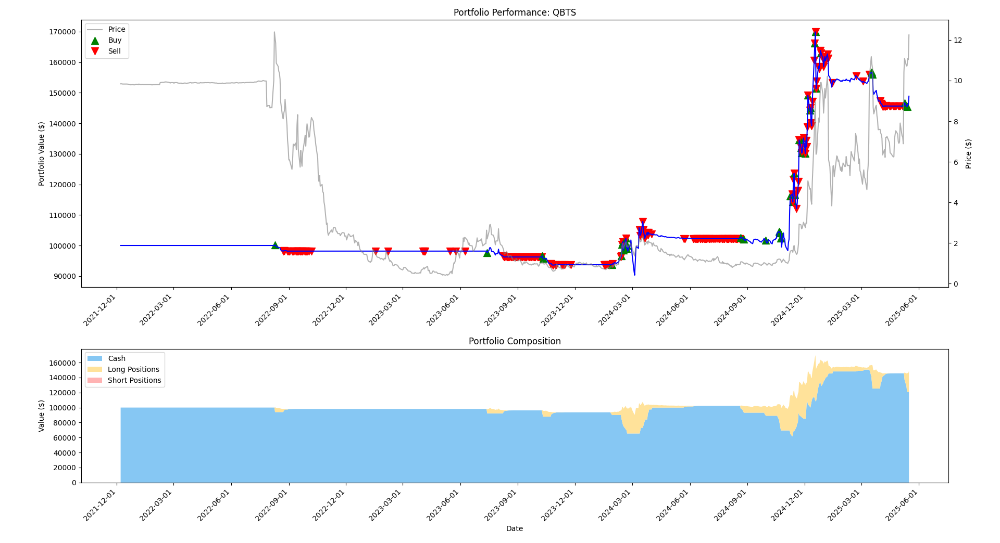

# EasyA-Consensus-Hackathon---Toronto

This project builts based on [the repo from aptos-agent from aptos-labs](https://github.com/aptos-labs/aptos-agent).

Aptos Agent Backtester: AI/ML-Powered Blockchain Trading Aptos Agent combines machine learning prediction with Aptos blockchain execution for automated trading. Features include **technical analysis signals**, on-chain transaction execution, **wallet management**, comprehensive **backtesting**, real-time **portfolio tracking**, and risk management parameters for DeFi traders.

Here is the snapshot of the project. 

\

[Here is the link of the presentation](https://www.canva.com/design/DAGnnzZRxhU/VGBKUeKuUp-0kf3HJntAHg/edit?utm_content=DAGnnzZRxhU&utm_campaign=designshare&utm_medium=link2&utm_source=sharebutton)

# Technical Explanation

Our Aptos Agent project leverages several key technologies:

## Core Technologies
- **Python** for backend development and ML model & Strategy implementation
- **Scikit-Learn/TensorFlow/PyTorch** for training prediction models
- **Aptos Move** for smart contract development
- **React** for frontend dashboard interface

## Aptos Blockchain Technologies
We specifically leveraged Aptos's unique features:

1. **Move VM** - Used for secure, deterministic smart contract execution that enables our automated trading strategies with reliable transaction outcomes

2. **Parallel Execution Engine** - Aptos's BlockSTM allows high throughput transactions, critical for real-time trading decisions during market fluctuations

3. **Aptos SDK** - Integrated their Python SDK for seamless blockchain interaction from our prediction models

4. **Aptos Tokenization Framework** - For portfolio management and tracking digital assets

5. **Fast Finality** - Aptos's sub-second finality ensures our trading signals are executed promptly, reducing slippage in volatile markets

<!-- What makes our project uniquely possible on Aptos is the combination of their high-performance blockchain (over 160,000 TPS) with sub-second finality, which is essential for algorithmic trading where execution speed matters. The Move language's resource-oriented programming also provides better security guarantees for managing user funds in a DeFi context compared to other blockchain environments. -->