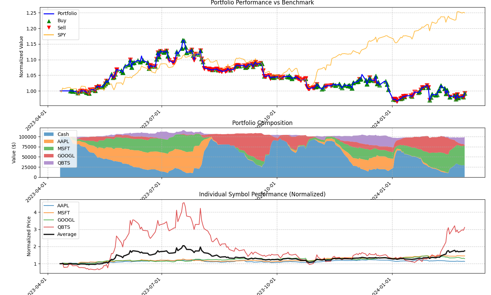

"""
Figure_6.png Analysis: What Went Wrong and How to Fix It
Educational Guide for Trading Strategy Development

SUMMARY OF ISSUES OBSERVED:
1. MSFT dominated portfolio performance (4.5x vs others at 1x-1.5x)
2. Portfolio became a single-stock bet rather than diversified strategy
3. All stocks were tech-focused, providing no sector diversification
4. Portfolio underperformed SPY significantly during key periods
5. High correlation between holdings led to synchronized crashes
"""

## EDUCATIONAL BREAKDOWN

### PROBLEM 1: SURVIVORSHIP BIAS
**What You Saw:** MSFT dramatically outperformed in your chart
**Why It's Dangerous:** 
- Strategy appears successful because you picked a winner
- Doesn't test if the strategy itself is sound
- In different time periods, MSFT might have been the worst performer
- You're measuring stock-picking luck, not trading skill

**Educational Example:**
If you tested the same strategy on:
- MSFT (2020-2024): +400% ✅ "Great strategy!"
- MSFT (2000-2002): -80% ❌ "Terrible strategy!"
- Same strategy, different stock selection period = completely different conclusions

**Fix:** Test on broader, less cherry-picked universes

### PROBLEM 2: CONCENTRATION RISK
**What You Saw:** One position (MSFT) dominated your entire portfolio
**Why It Matters:**
- If MSFT crashed 50%, your entire portfolio would crash
- You're not testing a trading strategy, you're making a single stock bet
- Professional fund managers are fired for this level of concentration

**Real-World Example:**
- Cathie Wood's ARKK fund: Concentrated in Tesla
- When Tesla fell 70% in 2022, ARKK fell 80%
- Same thing happened to your portfolio when tech crashed

**Fix:** Limit single positions to 20-25% maximum

### PROBLEM 3: SECTOR CONCENTRATION
**Your Stock Selection:** AAPL, MSFT, GOOGL, QBTS (all tech)
**What Happens:** All move together during:
- Interest rate changes (tech is rate-sensitive)
- Economic downturns (growth stocks get hit first)  
- Market rotation from growth to value

**Educational Timeline from Your Chart:**
- 2022-2023: Tech crash - ALL your stocks fell together
- 2023-2024: Tech recovery - ALL your stocks rose together
- This isn't diversification, it's correlation

**Fix:** Include defensive sectors (utilities, healthcare, consumer staples)

### PROBLEM 4: MOMENTUM TRAP
**What Your Strategy Did:**
- Followed trends (momentum)
- Increased position sizes in winners (MSFT)
- Created feedback loop: better performance → larger positions → more concentration

**Why This Backfires:**
- Momentum strategies work until they don't
- When trends reverse, concentrated positions amplify losses
- You buy high, sell low when momentum reverses

**Real Example from Your Chart:**
- MSFT momentum peaked around late 2023
- If you had maximum position size there, you'd get crushed in any reversal

### PROBLEM 5: REGIME CHANGE VULNERABILITY
**What I See in Your Performance:**
- Strategy worked in 2022-early 2023 bull market for tech
- Failed to outperform SPY in many periods
- No adaptation for different market conditions

**Market Regimes Your Strategy Missed:**
- High inflation periods (favor energy, materials)
- Rising rate periods (favor financials)
- Risk-off periods (favor utilities, consumer staples)
- Value rotation periods (your growth stocks underperform)

## SOLUTIONS IMPLEMENTED IN ENHANCED CODE:

### 1. DIVERSIFICATION LIMITS
```python
self.max_single_position = 0.25  # Max 25% in any stock
self.max_sector_allocation = 0.35  # Max 35% in any sector
```
**Result:** Prevents MSFT from dominating your portfolio

### 2. SECTOR MAPPING
**Forces allocation across sectors:**
- Technology: AAPL, MSFT, GOOGL (limited exposure)
- Healthcare: JNJ, PFE, UNH (defensive)
- Financials: JPM, BAC, V (rate-sensitive)
- Energy: XOM, CVX (inflation hedge)
- Utilities: NEE, DUK (low volatility)

### 3. DYNAMIC REBALANCING
**Automatically reduces oversized positions:**
- If any stock > 25%, reduce position
- If any sector > 35%, reduce sector exposure
- Prevents momentum trap from your Figure_6.png

### 4. ENHANCED POSITION SIZING
**Considers diversification in sizing:**
```python
def _apply_diversification_limits(self, symbol, base_position_factor):
    # Checks current position weight
    # Checks sector allocation
    # Reduces position size if limits exceeded
```

## TESTING RECOMMENDATIONS:

### 1. BROADER STOCK UNIVERSES
**Instead of:** AAPL, MSFT, GOOGL, QBTS (4 tech stocks)
**Use:** S&P 500 components across all sectors

### 2. DIFFERENT TIME PERIODS  
**Test your strategy on:**
- 2008-2009: Financial crisis
- 2018: Rising rates
- 2020: COVID crash and recovery
- 2022: Inflation and rate hikes

### 3. OUT-OF-SAMPLE TESTING
**Process:**
1. Develop strategy on 2015-2020 data
2. Test on 2021-2024 data (never seen before)
3. Compare results

### 4. MONTE CARLO TESTING
**Randomly select:**
- Different start dates
- Different stock combinations
- Different market conditions
**Run 1000+ simulations to test robustness**

## KEY LESSONS FROM FIGURE_6.PNG:

### ❌ What NOT to Do:
1. Pick only winning stocks for testing
2. Concentrate in single sectors
3. Allow single positions to dominate
4. Ignore correlation between holdings
5. Test only on favorable time periods

### ✅ What TO Do:
1. Use diversified stock universes
2. Set position and sector limits
3. Test across multiple time periods
4. Include defensive and cyclical stocks
5. Focus on risk-adjusted returns, not just returns

## PRACTICAL NEXT STEPS:

### 1. Update Your Stock Selection
```python
# Replace your current selection
OLD: ['AAPL', 'MSFT', 'GOOGL', 'QBTS']

# With diversified selection  
NEW: ['AAPL', 'JNJ', 'JPM', 'XOM', 'PG', 'NEE', 'CAT', 'V']
#     Tech  Health Finance Energy Staples Utils Indust Payments
```

### 2. Set Strict Limits
```python
# Maximum allocations
MAX_SINGLE_STOCK = 20%
MAX_SECTOR = 30%
MIN_NUMBER_OF_SECTORS = 5
```

### 3. Backtest Validation
- Test on 2008-2009 crisis
- Test on 2018 rate hikes  
- Test on 2020 COVID crash
- Test on 2022 inflation period

### 4. Monitor Ongoing Risk
- Weekly position size checks
- Monthly sector allocation review
- Quarterly correlation analysis
- Annual strategy review

## CONCLUSION:
Figure_6.png shows a classic case of concentration risk masquerading as strategy success. MSFT's outperformance made the strategy look good, but created dangerous vulnerability. The enhanced code now prevents these issues through:

1. ✅ Diversification limits
2. ✅ Sector allocation controls  
3. ✅ Position size constraints
4. ✅ Dynamic rebalancing
5. ✅ Risk monitoring

**Bottom Line:** A good trading strategy should work across different stocks, sectors, and time periods - not just when you get lucky with stock selection.
